# Durable sync pipeline — implemented contract

Extraction update, 2026-09-28: the [v2 grounded evidence contract](./extraction-coverage-v2.md) governs receipts/publication, including nested workflow/scenario fields. Its version participates in processing hashes. Stale automatic unverified proposals are removed on publication; changed reviewed evidence is flagged for re-review. Broad extraction and semantic reconciliation remain incomplete.

Implemented 2026-09-27. This supersedes the old queue/counter lifecycle in `sync-pipeline.md` for newly admitted jobs. It does not claim production readiness or measured extraction accuracy.

## What changed

New manual, incremental and webhook sync requests persist a version-1 `sync_jobs` record before returning. A database-backed dispatcher delivers it to the Bull `pipeline` queue. The queue is transport; PostgreSQL determines whether work is pending, leased, retryable or terminal.

The previous `sync-source` and `process-document` consumers are no longer registered. Their implementations remain in the repository for compatibility analysis and the earlier regressions. Retained legacy Redis jobs are not processed by the new application.

```mermaid
flowchart LR
    Request[Source API / webhook] --> Admission[Persist request and source status]
    Admission --> Pending[PostgreSQL pending work]
    Pending --> Dispatcher[Claim delivery lease]
    Dispatcher --> Redis[Bull pipeline queue]
    Redis --> Worker[Worker validates lease]
    Worker --> Manifest[Immutable document snapshots]
    Manifest --> Index[Indexing receipts]
    Index --> Extract[Extraction receipts]
    Extract --> Publish[Atomic PostgreSQL publication]
    Publish --> Completed[Documents + chunks + knowledge + checkpoint]
    Pending --> Recovery[Poll after restart / lease expiry]
    Recovery --> Dispatcher
```



## Persistent records

- `sync_jobs.pipelineVersion = 1` identifies this implementation. `request` stores the mode and selection; webhook jobs also store their supplied documents.
- `leaseToken` and `leaseUntil` identify the only delivery allowed to write. `attempts` counts started worker attempts; `nextAttemptAt` gates retry dispatch.
- `sync_work` stores one immutable snapshot per job/external ID, an assigned document ID, revision hash, and nullable indexing/extraction outputs. A non-null empty output is a valid completed receipt; null means not completed.
- `documents.processedHash` is written only during successful publication. It includes document content, title, type, URL, metadata, attachment references and processing configuration. Failed work cannot cause the next sync to skip a document.
- Manual sync can request **Force extract context**. Unchanged documents are sent through extraction again while their already-published chunks and embeddings are retained; changed or never-indexed documents still follow normal indexing. Forced extraction is recorded in job metadata and remains subject to the grounded candidate formats supported by the configured extractor.
- Processing configuration includes embedding/extraction provider and model plus `PIPELINE_PROCESSOR_VERSION` (default `1`). Increment that version when changing processor/prompt semantics. A worker rejects a job created with different processing configuration rather than mixing receipts from different configurations.

No source credentials are copied into the durable request. Document content and extracted content still require the platform's outstanding tenant/secret/retention work.

## Admission and ordering

Admission locks the source row and checks for any queued/running job, including legacy jobs. Two simultaneous requests cannot both start a sync for the same source through this interface. Requests for different sources are independent.

Selective requests require nonempty string IDs. Missing selected documents and non-advancing connector cursors produce explicit errors. Duplicate external IDs produce one manifest entry. The initial batch envelope is 10,000 documents, 50 MiB of serialized manifest data and 1,000 connector pages; exceeding it fails with a scope-narrowing message rather than silently truncating. This is an initial bounded-batch implementation, not streaming ingestion for arbitrarily large organizations.

A webhook received while another source sync is active is rejected; it is not acknowledged as durably accepted. The sender/operator must retry or redeliver. A durable per-source webhook backlog is outstanding work.

## Recovery and retries

The dispatcher polls every two seconds and claims at most ten available jobs per pass. Each delivery has a random token and a 120-second lease. A worker renews every 30 seconds and at operation boundaries. Duplicate delivery with the same token cannot start a second execution.

If the process dies after admission but before enqueue, the persisted job remains discoverable. If it dies after claiming but before delivery, lease expiry allows redispatch. Redis failure does not consume worker attempts. If a worker dies, a later delivery resumes its manifest and completed document receipts. Expired/superseded tokens cannot save receipts, renew their lease or publish.

Provider/connector operations have a 90-second wait limit. Embeddings are requested in batches of 64 chunks and validated for count, configured dimension, finite values and nonzero vectors. The pipeline allows three started attempts, with exponential delay after recoverable errors. Exhaustion records a terminal failure and releases the source.

The timeout bounds how long the pipeline waits; it does not guarantee cancellation of an already-issued provider HTTP request. External calls can repeat if a process dies after a provider responds but before a receipt commits. Exactly-once provider billing is not claimed.

## Cancellation and publication

Cancellation and all worker mutations acquire database locks in source-then-job order. Cancellation clears the lease and marks the job terminal. A provider result returning afterward cannot become a receipt or mutate published data.

Publication validates every required receipt, then writes documents, replacement chunks, business items/relationships, job completion and source checkpoint in one PostgreSQL transaction. Any database failure rolls all of them back. Repeating publication with an expired or completed lease is rejected. Existing published document/chunk versions remain readable while a replacement is prepared or cancelled.

Cancellation and publication are serialized: if publication commits first, cancelling the already-completed job is rejected. If cancellation commits first, publication is rejected. This is not an undo operation.

Non-selective connector jobs publish their discovery-start timestamp as the next incremental watermark. They do not use fetch-completion timestamps, which could miss updates during pagination. Selective and webhook jobs do not advance the global watermark. Source counts come from persisted documents instead of incrementing by fetched counts.

Business-item writes are document/source scoped. Reviewed items are preserved, and ambiguous/unresolved relationship endpoints are counted rather than linked arbitrarily. The metadata fields `preservedReviewedItems` and `unresolvedRelationships` report those cases. Semantic stale-fact reconciliation and human-review proposals remain outstanding.

## Projection and attachment limits

PostgreSQL is authoritative for this path. It does not publish new changes into Neo4j, and graph data can therefore lag. A durable graph projection/outbox is still required; graph screens must not be treated as authoritative for new pipeline output.

Attachment references are retained in document metadata. Binary attachment download/upload is not performed in this path. A separately retried object-storage stage is still required. Full sync also does not delete documents missing from the source; deletion/tombstone reconciliation remains outstanding.

SSE emits persisted progress/completion/cancellation snapshots. Events are not durably replayed; reconnecting clients should reload job state. Heavy publication remains a single transaction and needs capacity testing before increasing the initial batch limits.

## Rollout

1. Stop/drain old API and worker processes. Do not run old and new workers against the same queues during rollout.
2. Back up the database using the organization's normal procedure.
3. Apply `apps/api/migrations/20260927-durable-sync-pipeline.sql` to the intended database. It is additive and rerunnable. Development TypeORM synchronization also recognizes these columns, but production must use the migration.
4. Deploy all new API/worker processes together. Legacy queued jobs are not automatically converted. Cancel legacy queued/running jobs through the existing API, then start fresh syncs.
5. Old documents have no `processedHash`; their first new sync reprocesses them. Only successful publication makes subsequent unchanged syncs skippable.
6. Verify a small full sync, a no-change sync, a selective sync and cancellation before onboarding additional sources.

The migration has been tested against an isolated legacy-shaped schema, including applying it twice. It has not been applied to the user's development or production database by this work.

## Reproduce verification

The test stack uses distinct project/container names and localhost-only ports 55432 and 56379. It does not reuse the application's normal databases.

```sh
docker compose -p qa-pipeline-tests -f docker-compose.pipeline-test.yml up -d --wait
npm run test:pipeline-recovery -w apps/api
npm test -w apps/api -- --runInBand
docker compose -p qa-pipeline-tests -f docker-compose.pipeline-test.yml down
```

All 21 integration tests pass, including a full sync through Nest's registered Bull worker and repeat application of the SQL migration. The suite uses real PostgreSQL locking/transactions and real Redis/Bull delivery. Connector and AI responses are controlled test doubles. It tests recovery by recreating the store/worker and expiring a persisted lease, not by killing an OS process. Model quality, remote connector behavior, full browser UI behavior, sustained load and tenant isolation are not established by these tests.
