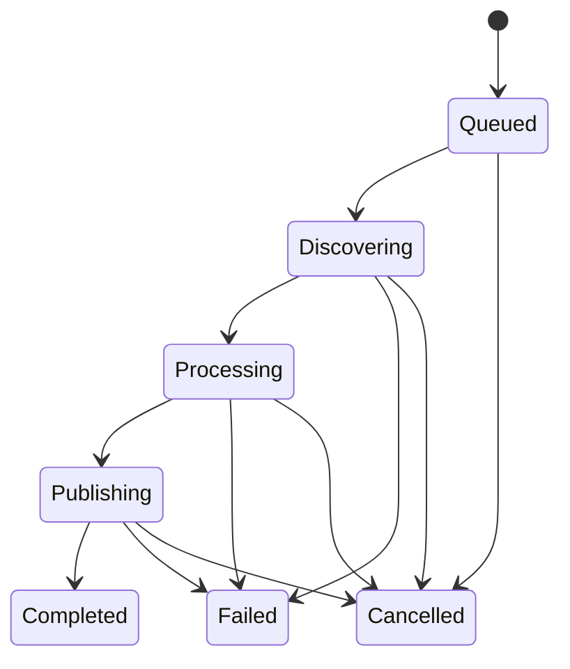

# Super QA delivery design

Status: proposed implementation contracts, except for the fixes explicitly listed in [implementation-log.md](implementation-log.md). This document does not describe a completed platform.

## First acceptance journey

Use a local sample application and synthetic source fixtures until a real acceptance target is supplied. The sample needs a login journey, role restriction and a state-changing operation, with both healthy and deliberately defective variants.

Connect sources → ingest versioned documents → review grounded requirements → QAE proposes tests → approve a test version → AUE produces executable automation → validate the patch → execute in an isolated environment → inspect assertions/artifacts → report a finding → rerun against a fix.

The same journey must survive process restarts, report provider outages honestly and preserve the first failed attempt when a retry passes. UI work should expose these records instead of constructing separate demo records.

## Pipeline module

The public interface should be `startSync(sourceId, request)`, `getSync(jobId)` and `cancelSync(jobId)`. Callers should not coordinate counters, stage transitions or dispatch order themselves. The module owns that implementation. Connectors and provider clients are injected adapters, so deterministic fixtures and real integrations cross the same seam.

### Durable records

| Record | Identity and invariant |
| --- | --- |
| Source | Workspace-scoped identity; one active sync generation per source |
| Document revision | Source + external ID + content/metadata revision; immutable input to downstream work |
| Sync manifest | Job + document revision; frozen after discovery completes |
| Stage receipt | Unique job + revision + stage + processor version; stores outcome and artifact reference |
| Dispatch outbox | Unique operation key; committed with the state that requires its delivery |
| Knowledge proposal | Revision, source span, schema/model/prompt versions, validation outcome |
| Source checkpoint | Last fully published sync's discovery-start watermark; never advanced by a selective job |

A counter is a projection of receipts, not proof that a particular document finished. Queue deduplication is helpful but cannot replace database uniqueness or recovery.

### Lifecycle

Terminal transitions are conditional and irreversible within the same job. Retrying a terminal job creates a new attempt linked to the old one. Recoverable individual-stage retries remain within a bounded active attempt.

Persist each page/manifest entry with an outbox event. Dispatch indexing/extraction as independent document-stage work with prerequisites, rather than running a full source's extraction inside the last embedding worker. Publish completion only after all required receipts succeed. Graph updates can be a separately visible projection; they must not silently redefine authoritative success.

Keep the previous searchable revision active while a replacement is processing. Atomically publish the new revision and invalidate old proposals after successful validation. Handle deletions and revoked permissions explicitly. Cancellation and newer generations fence late worker writes.

### Required failure tests

- Crash after document commit but before enqueue: outbox recovery delivers the work.
- Duplicate delivery and retry after successful write: no duplicate chunks, facts or completion receipts.
- Worker dies after provider response: bounded retry/cache avoids uncontrolled cost; job eventually resolves.
- Cancel during a provider call: late response cannot publish changes or complete the job.
- Two sync triggers race: only one source generation wins.
- Selective sync, empty result, unchanged document, title-only change and more than 1,000 documents: exact manifest semantics.
- Provider timeout, malformed vector, malformed extraction and storage outage: explicit failure, no checkpoint advancement.
- Source changes during pagination: the next incremental sync does not miss updates.

## Knowledge module

Its interface returns bounded evidence bundles, not arbitrary global business-item lists. Every bundle carries authorized workspace/source scope, revision IDs, citations, freshness and conflicts.

Use deterministic parsers for structured artifacts such as OpenAPI and existing test metadata. Route prose only to relevant extraction schemas. An LLM proposal must include an exact quote/span validated against the original revision. Separate extracted statements from model inferences and human-approved facts. A confidence score is not a substitute for that distinction.

Cache key: workspace + revision hash + schema version + prompt version + provider/model configuration. Invalidate on permission changes. Retrieval must apply authorization before ranking and must not mix embedding spaces. Version prompts, fixtures and relevance labels together.

## Shared agent harness module

Implementation update (2026-09-28): the bounded proposal/review subset is delivered in [shared-agent-harness.md](shared-agent-harness.md). The executable automation, independent artifact verification and tenant-authenticated contracts below remain targets, not completed capabilities.

Keep one small interface for both roles: `submit(task)`, `status(runId)`, `cancel(runId)` and `review(proposalId, decision)`. QAE and AUE vary in their planning/tool adapters; persistence, budgets, policy, evidence and verdict rules belong to the shared implementation.

### Task contract

Each task must identify workspace, application, actor, role, objective, source/requirement revisions, target environment, allowed capabilities, budget and idempotency key. Missing environment, authority or test oracle results in a clarification/blocked outcome, not guessed production access.

### Run contract

Persist status, current plan revision, attempts, tool observations, input/output references, actual provider usage, duration and termination reason. Store compact decision summaries and evidence references; do not require private model reasoning. Model text is never the authoritative execution verdict.

Use statuses that distinguish queued, running, awaiting review, blocked, succeeded, failed, cancelled and budget exhausted. Individual test verdicts additionally distinguish product assertion failure, infrastructure error, unsupported test and flaky retry. Preserve all attempts.

### QAE contract

1. Retrieve the relevant requirement revisions and unresolved conflicts.
2. Propose risk-ranked coverage tied to evidence.
3. Produce structured cases with preconditions, data requirements, actions, explicit assertions and cleanup.
4. Validate schema and traceability; ask for clarification when expected behavior is unsupported.
5. Persist proposals for review and version accepted cases.
6. Interpret deterministic execution evidence into classified findings with reproduction steps.

### AUE contract

1. Start from an approved test version and allowed repository/environment.
2. Inspect existing framework, fixtures and locator conventions.
3. Produce a minimal patch and deterministic execution plan.
4. Run configured static checks and isolated tests.
5. Propose the patch with evidence and limitations for review.
6. For healing, prove the original assertion still runs; never weaken or delete it to obtain green.

### Enforced economics

Reserve a task budget before model/tool calls. Bound total model calls, input/output tokens, wall time, tool calls and concurrency. Record provider-reported usage when available and mark estimates explicitly. Use a configured price schedule for monetary estimates; do not hardcode undocumented current prices.

Use a small evidence bundle, compact tool outputs and persistent artifacts referenced by ID. Cache deterministic interpretation and unchanged extraction results. Avoid model calls per execution step when a validated plan already exists. Escalate to a more capable model only after a specific validation failure and within remaining budget. Stop repeated identical tool calls with unchanged observations.

Run the same labeled corpus across configurations. Optimize cost per accepted, evidence-supported artifact while holding defect detection and false-pass gates fixed. Model identity alone does not establish accuracy.

## Product and onboarding

PostgreSQL owns cases, revisions, reviews, executions, assertions, findings, memberships and audit records. Object storage owns large evidence artifacts. Redis transports work; it is not the only durable source of truth. Treat the graph as optional until a measured query warrants it; defer additional QA databases.

Onboarding collects application/repository identity, authoritative sources, approved environments, test-data lifecycle, critical journeys, owners, CI policy and permitted actions. Tenant isolation, secret handling and sandbox policy must exist before outside organizations onboard. Initial success means a verified local vertical slice; enterprise readiness requires separate isolation, recovery, capacity and operational acceptance gates.

## Evaluation artifacts

Maintain versioned inputs, labeled expected outcomes, model/prompt/tool versions, predicted outcomes, evidence references, token usage and duration. Include ambiguous requirements, contradictions, source injection attempts, missing permissions, unavailable dependencies, unparseable steps and seeded application defects.

Publish extraction precision/recall, retrieval recall@k, oracle coverage, defect detection, false passes, false failures, flake rate and cost distributions with denominators. No unsupported claim of universal QA coverage or replacement accuracy.
