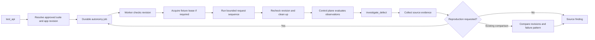

# API testing and defect investigation

Status: bounded C3 implementation. Both workflows are registered for QAE and AUE and available through the existing HTTP, CLI, agent and QA MCP dispatchers. They make zero model calls. Live adapter acceptance has not been run; Phase 1 remains open.

## Workflow boundaries



The skill submits work; the worker owns HTTP requests and dataset cleanup. The control plane evaluates approved assertions from bounded worker observations. A completed skill invocation is not a passing API test. Poll `get_execution_job` with `provider: "autonomy"` and the same `suite_profile_id`.

| Skill | Executable operations | Graph |
| --- | --- | --- |
| `test_api` | `resolve_suite_profile`, `enqueue_api_sequence` | `admit_api_sequence` |
| `investigate_defect` | `resolve_suite_profile`, `collect_failure_evidence`, `queue_reproduction_attempt`, `compare_failure_evidence` | `collect_source → resolve_comparison → assemble_finding` |

No new per-skill MCP server or skill-named tool is introduced. Existing discovery exposes actual dependencies and input schemas.

## Approved API profiles

An `api_flow` suite has exactly one check with `id`, `requirement`, `kind: "api_flow"`, and the SHA-256 `profileHash`. The requirement must belong to the app. Create and approve the suite through the existing autonomy control plane; only the app owner can approve it.

The operator supplies an immutable UTF-8 JSON file on the worker. Example shape (replace the project, domain, revision, dataset hash and routes with actual approved values):

```json
{
  "projectId": "11111111-1111-4111-8111-111111111111",
  "environment": "staging",
  "origin": "https://staging.example.com",
  "targetRevision": "reviewed-deployment-revision",
  "revisionProbe": { "path": "/health", "pointer": "/revision" },
  "datasetProfileHash": "<SHA-256 of the approved dataset blueprint>",
  "datasetOrigin": "https://staging.example.com",
  "steps": [
    {
      "id": "access-denied",
      "method": "GET",
      "path": "/qa/{namespace}/items",
      "auth": "anonymous",
      "expectedStatus": 401,
      "assertions": [{ "id": "auth-error", "pointer": "/code", "expected": "unauthorized" }]
    },
    {
      "id": "invalid-item",
      "method": "POST",
      "path": "/qa/{namespace}/items",
      "body": { "name": "" },
      "expectedStatus": 400,
      "assertions": [{ "id": "validation-error", "pointer": "/code", "expected": "name_required" }]
    },
    {
      "id": "create-item",
      "method": "POST",
      "path": "/qa/{namespace}/items",
      "body": { "name": { "$fixture": "/0/name" } },
      "expectedStatus": 201,
      "assertions": [{ "id": "created-shape", "pointer": "", "schema": { "type": "object", "required": ["id", "state"], "properties": { "id": { "type": "string", "minLength": 1 }, "state": { "type": "string" } } } }],
      "captures": { "itemId": "/id" }
    },
    {
      "id": "read-item",
      "method": "GET",
      "path": "/qa/{namespace}/items/{itemId}",
      "expectedStatus": 200,
      "assertions": [{ "id": "item-state", "pointer": "/state", "expected": "created" }]
    }
  ]
}
```

The example is a template, not an executable fixture or a claim about Herdly. The target must implement the namespaced fixture lease contract described in [repository execution](qa-repository-execution.md). A profile containing only GETs may omit both dataset fields. All non-GET requests require a dataset and a literal `{namespace}` path segment. Dataset cleanup deletes and confirms absence of the entire job namespace, including created records.

Supported behavior and limits:

- 1–6 ordered requests; GET, POST, PUT, PATCH and DELETE; 4 assertions and 4 captures per step.
- Explicit expected HTTP status, including 4xx/5xx negative cases. Redirects are rejected. A matching negative-case status may pass; transport/parse failures cannot.
- Each assertion uses an RFC 6901 pointer with either an exact JSON `expected` value (including `null`) or `schema`, exclusively. Missing values are recorded with `present: false`.
- The schema subset supports `type`, object `properties`/`required`/`additionalProperties`, array `items`/`minItems`/`maxItems`, and string `minLength`/`maxLength`. It is **not full JSON Schema**. Unknown keywords are rejected. Schema depth is bounded to 6.
- JSON equality compares objects without key-order dependence and keeps booleans distinct from numbers. Evidence numbers must be finite and within JavaScript's safe magnitude; selected values are capped at 2 KiB, nesting at 12. Select small response fields, not entire large documents.
- `$fixture` reads a pointer from the prepared records array; `$capture` uses a scalar captured by an earlier successful step. Path captures must be safe alphanumeric/underscore/hyphen strings. Captures cannot overwrite values. No expressions or arbitrary code are evaluated.
- `auth: "configured"` uses an operator-configured bearer secret for the origin; `anonymous` suppresses bearer and cookie credentials. No token values appear in profile metadata or workflow inputs.
- A status/assertion mismatch stops dependent requests. Remaining steps are `not_run`, preserving the first failure. An interrupted, incomplete, changed-revision or cleanup-pending run cannot pass.
- The HTTPS revision probe must return the exact string before and after the sequence. This checks those two observations; it cannot prove a deployment did not change transiently between them.
- Existing transport enforces configured origins, DNS pinning, CIDR policy, TLS verification, no redirects and per-request timeouts. There is no request replay after uncertain transport failure.

### Configuration

Generate control-plane metadata without executing requests:

```sh
PYTHONPATH=agents python -m shared.harness.api_flow /absolute/api-profile.json
```

Set the printed hash-to-metadata mapping as `AUTONOMY_API_PROFILES` on the API. On the worker set:

- `AUTONOMY_API_PROFILE_PATHS`: map the same hash to the absolute immutable profile file.
- `AUTONOMY_API_STATE`: private durable journal/evidence directory, separate from other worker processes.
- `AUTONOMY_ALLOWED_ORIGINS`, optional private `AUTONOMY_ALLOWED_CIDRS` and `AUTONOMY_CA_FILE`.
- `AUTONOMY_SECRET_REFS`: origin-to-environment-variable mapping when authenticated requests are needed.
- `AUTONOMY_DATASET_PROFILE_PATHS`: approved fixture blueprints if this profile requires one.
- Existing `AUTONOMY_PROJECT_KEY` runner credential and `BACKEND_API_URL`.

The agent uses `QA_AUTOMATION_SUITES` bindings and per-app `QA_WORKFLOW_RESOURCES.automation_suites` exactly as repository execution does. Its binding pins the approved suite, profile hash, project and credential reference. Grant the fixture blueprint separately through `dataset_profiles` when preparation is needed.

Start the existing autonomy worker; it dispatches `api_flow` jobs alongside existing check kinds. Its startup/poll recovery now checks both configured API and repository journals. Existing repository journals receive an additive `kind` column with a `repository` default. API flows do not need Docker. No new PostgreSQL migration is required beyond the C2 dataset/cleanup columns.

The journal commits the job and lease intent before side effects. On completion it persists a bounded evidence file and an exact completion payload before attempting control-plane delivery. Recovery retries cleanup and completion delivery without replaying requests. Cleanup receipts remain visible after cancellation/interruption. When original report delivery is no longer authorized, cleanup may still be reported by a valid recovery runner with the original private job token; report recovery requires the original worker identity while the run is active. Retain old profile files until their pending leases are cleaned up.

### Invocation

Use a real caller-generated UUID as `request_id` and reuse it only for identical retries:

```json
{
  "skill_name": "test_api",
  "request_id": "22222222-2222-4222-8222-222222222222",
  "inputs": {
    "suite_profile_id": "staging-api",
    "expected_target_revision": "reviewed-deployment-revision",
    "dataset_artifact": { "request_id": "33333333-3333-4333-8333-333333333333", "content_hash": "<published fixture artifact SHA-256>" }
  }
}
```

Omit `dataset_artifact` only for a suite whose profile does not require a dataset. Fixture publication, hash, app scope, profile and environment are checked by the control plane; the worker reproduces its records from the approved blueprint and seed before provisioning.

## Defect investigation

`investigate_defect` accepts `suite_profile_id`, `source_execution_id`, `check_id`, optional repository `test_id`, and either `reproduce: true` or `comparison_execution_id`. The source must contain a completed failed/error check. Pure reading does not require execution permission. Reproduction requires execution permission and a new stable request UUID, distinct from the source job's request.

```json
{
  "skill_name": "investigate_defect",
  "request_id": "44444444-4444-4444-8444-444444444444",
  "inputs": {
    "suite_profile_id": "staging-api",
    "source_execution_id": "55555555-5555-4555-8555-555555555555",
    "check_id": "api-contract",
    "reproduce": true
  }
}
```

Reproduction submits one **whole approved suite**, with the same published fixture, unchanged expectations and existing quota/approval checks. A repository `test_id` focuses the report; it does not narrow suite execution. Poll the returned job. Then make a new investigation invocation with `comparison_execution_id` and `reproduce: false` to assemble the comparison. Reusing the first invocation UUID returns its immutable historical pending artifact.

Reports retain source/comparison IDs, check/test IDs, profile/manifest hashes, fixture hash, observed revisions, expected/actual assertion evidence, attempts and artifact pointers. They do not include fixture records, request bodies or credentials. Server-derived API assertions carry the approved expectation; repository reports retain runner attempts without inventing missing assertion text.

| Finding state | Meaning |
| --- | --- |
| `pending` | A reproduction was submitted or the comparison job is still active |
| `reproduced` | The same assertion failure pattern was observed in a separate job with matching known app revision, profile and fixture context |
| `not_reproduced` | The comparison passed in matching context; this does not prove a fix |
| `different_failure` | The comparison failed at other assertions |
| `incomparable` | Revisions/profiles/fixtures differ, or observed app revision is unavailable |
| `blocked` | Comparison execution lacks complete assertion evidence |
| `insufficient_evidence` | Source-only finding, or no selected assertion failure is established |

Legacy repository profiles lack observed target-app revisions, so their cross-job comparisons remain `incomparable`. New [instrumented repository profiles](qa-regression-selection.md) record the configured origin’s revision before and after execution and can participate in matching-context comparisons. The repository commit alone is insufficient to establish identical app behavior. Transport, report and cleanup errors remain infrastructure/missing-evidence findings. Root cause is always `unproven` in this deterministic slice; no issue is sent to an external tracker.

Agent Settings → Skills → Recent workflow results shows API step outcomes, expected/observed status, revision probes and current cleanup state. Investigation reports show their comparison state and blockers. Submitted reproduction jobs use the same current-job view as API and repository execution.

## Remaining acceptance and depth

Implementation checks: API build, frontend TypeScript compilation, Python syntax/imports and graph/catalog construction. No tests, live HTTP scenarios, dataset changes, LLM calls or production deployment were performed for this slice.

Still required before C3 acceptance: controlled positive/negative/auth/mutation scenarios; missing/changed app revision; malformed/oversized response; assertion/schema failures; step dependencies; cleanup failure/restart; cancelled and expired claims; report retry/idempotency; scope denial; same/different failure reproduction; and UI retrieval against real published artifacts. No live API suite has been enrolled locally.

Future depth includes richer schema/business-rule dialects, multi-identity authorization matrices, cross-origin flows, repository assertion diagnostics and target revision evidence, and evidence-grounded hypotheses. These are not advertised as implemented capabilities.
