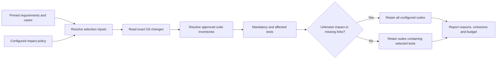

# Regression selection, case links and app revisions

Status: first C4 implementation slice. `select_regression_tests` is wired for QAE and AUE through the existing agent, MCP, HTTP and CLI dispatchers. It is deterministic and read-only. No repository jobs or acceptance scenarios have been executed for this slice.

## What it does

The workflow resolves pinned requirement and case artifacts, reads the file-name diff between two exact Git commits, resolves current approved repository suite inventories, and selects whole suites from operator-defined impact rules. It rechecks requirement freshness, the policy file hash and suite metadata before finalizing.



Operations are `resolve_regression_policy`, shared artifact/resource readers, `read_pinned_revision_changes`, `resolve_mapped_suite_inventory`, and `select_impacted_suites`. They appear as actual workflow dependencies in agent settings. No new MCP server is required.

### Selection rules

- At least one mandatory smoke test must be configured. Its whole approved suite is always selected, including when the commit trees have no changes.
- Exact file rules match a single path. Rules ending in `/` match a directory prefix. No globs, arbitrary expressions or code execution.
- Renames are treated as deleted/added paths so both locations participate in impact analysis. Working-directory changes are excluded.
- Changed paths select every mapped test and its entire approved suite. Existing workers do not support arbitrary test subsets; the report includes tests added because they share a selected suite.
- Unmapped changed files, tests without impact/case mappings, or cases without mapped tests broaden selection to all suites in this policy. This cannot establish coverage outside that configured inventory.
- The test budget never removes mandatory, affected or fallback tests. Overruns produce `state: "budget_exceeded"`, retaining required scope. Resolve the scope/budget before scheduling.
- Priority is an explicit operator-supplied number (5 highest) used for ordering, never for silently dropping tests.
- Output includes selected/omitted suites, individual reasons, matched paths, case/requirement IDs, revision pins, mapping gaps and counts. Counts are per suite invocation; the same test in two suites counts twice.
- Selection is a recommendation. It neither runs tests nor grants execution approval, and case artifacts remain drafts.

The first adapter requires one configured repository for both change analysis and the candidate repository suites. Cross-repository dependency graphs, API-only suite selection, historical-duration budgets, flaky-test quarantine and model-generated impact mappings are not implemented.

## Repository profile additions

New profiles may include the following fields alongside the existing framework/runner settings:

```json
{
  "targetOrigin": "https://staging.example.com",
  "targetRevision": "reviewed-deployment-revision",
  "revisionProbe": { "path": "/health", "pointer": "/revision" },
  "caseArtifact": {
    "requestId": "11111111-1111-4111-8111-111111111111",
    "contentHash": "<published case artifact SHA-256>",
    "snapshotHash": "<requirement snapshot SHA-256>"
  },
  "caseLinks": [
    { "testId": "<approved framework test SHA-256>", "caseId": "CASE-1", "caseRevision": 1 }
  ]
}
```

These are template placeholders. Use real artifact references and IDs from the approved framework inventory.

Generate updated metadata with the existing repository profile CLI and install it in `AUTONOMY_REPOSITORY_PROFILES`. Changed profile bytes have a new hash and need a newly reviewed/approved suite. Grant the HTTPS origin to the app and worker transport, and retain old profile files for cleanup recovery.

### App revision evidence

`targetOrigin`, `targetRevision` and `revisionProbe` must be supplied together. If a dataset is used, its origin must equal the configured target origin. The worker reads the bounded HTTPS revision probe before provisioning/running and after report ingestion. Both observations must equal the approved revision for an instrumented run to pass. Probe failures, unavailable revisions and mismatches produce `revision_error`; cleanup still runs.

The runner receives `QA_TARGET_ORIGIN`. The approved repository configuration must use that origin (for example by reading the environment variable in its framework configuration). The probes establish the revision at the configured origin at two instants; they do not inspect every URL visited by project code or prove there was no transient deployment change between probes. Network confinement remains the worker operator's responsibility.

Repository job results include the expected target revision, origin and both observed values. `investigate_defect` can compare new repository jobs with matching known target/repository/profile/fixture context. Legacy profiles remain supported but lack this evidence; comparisons involving them remain incomparable.

`run_automation_suite` now takes optional `expected_target_revision`. It is required to match profiles that have a target revision, and must be omitted for legacy profiles. This binds caller intent to the approved target revision before enqueueing.

### Case-to-test links

A mapping pins one published `qae.design_test_cases` artifact and its requirement snapshot. On suite creation/approval/admission/claim and completion, the API validates the artifact in the same app and checks mapped case IDs/revisions against it. Links must use expected test IDs and cannot duplicate a test/case pair.

Results retain the pin and links alongside per-test attempt histories. `identityObserved` is true only when the complete worker report contains that expected test identity and matching execution metadata. Semantic correspondence between a case and test is **operator-declared**; matching IDs does not prove behavioral coverage. Consumers can follow the case artifact's existing requirement provenance to the versioned source.

Regression selection additionally rejects missing/foreign criterion links, mismatched case pins, differing repository revisions or differing expected app revisions. These checks prevent stale mappings from qualifying as current selection inputs.

No PostgreSQL schema migration is required: the profile additions are pinned metadata and the result additions use existing JSON records. Existing profiles, artifacts and jobs remain readable.

## Impact policy configuration

Set `QA_REGRESSION_PROFILES` to an ID-to-absolute-JSON-path map, such as:

```json
{ "checkout-regression": "/srv/qa/regression/checkout.json" }
```

Example policy file:

```json
{
  "repository_id": "web-app",
  "suites": [
    {
      "suite_profile_id": "checkout-smoke",
      "tests": [
        {
          "test_id": "<approved framework test SHA-256>",
          "paths": ["src/checkout/", "src/shared/session.ts"],
          "mandatory": true,
          "priority": 5
        }
      ]
    }
  ]
}
```

Grant `regression_profiles`, the underlying `repositories`, and `automation_suites` in the app's existing `QA_WORKFLOW_RESOURCES` entry. The binding uses the same project-scoped control-plane credential as repository execution. Pure selection can run for assignments without execution permission; the credential still needs read access to the approved suite.

Policies are capped at 128 KB, 10 suites and 100 tests per suite; diffs at 2,000 paths and 256 KB. Git commands read exact commit objects and file names, disable external diff/text conversion, and never execute repository scripts. Keep relevant case artifacts published before approving linked suites.

## Invocation and handoff

```json
{
  "skill_name": "select_regression_tests",
  "inputs": {
    "profile_id": "checkout-regression",
    "base_revision": "<base 40-character Git commit>",
    "head_revision": "<candidate 40-character Git commit>",
    "expected_target_revision": "reviewed-deployment-revision",
    "requirement_review": {
      "request_id": "22222222-2222-4222-8222-222222222222",
      "content_hash": "<review artifact SHA-256>",
      "current_snapshot_hash": "<requirement snapshot SHA-256>"
    },
    "case_artifact": {
      "request_id": "11111111-1111-4111-8111-111111111111",
      "content_hash": "<case artifact SHA-256>"
    },
    "max_tests": 100
  }
}
```

Configured requirement snapshots are independently rechecked. Supplied snapshots require the caller's current snapshot hash, which is recorded as caller-asserted freshness. The workflow cannot infer upstream currency for supplied documents.

For each selected suite, the report supplies `suite_profile_id`, `repository_revision`, `target_revision` and whether it requires a dataset. Submit it through `run_automation_suite` with a new stable request UUID and the corresponding published fixture when needed. Admission rechecks current approval, revision and dataset compatibility. There is no automatic selection-to-execution pipeline in this slice.

Agent Settings → Skills → Recent workflow results shows selected/omitted suites, test/case IDs, selection reasons and budget/fallback warnings. Current repository job views show app revision probes and declared/observed case mappings.

## Remaining work

No tests, Git-based acceptance scenarios, live probes, container runs or fixture mutations were performed. Implementation checks are API/frontend compilation, Python and Node syntax, graph/catalog construction and local runtime discovery. Actual acceptance remains open for deleted/renamed/unmapped paths, stale artifacts, mandatory tests, over-budget selection, missing mappings, app revision mismatches, case identity evidence and recovery.

Both remaining C4 skills, `maintain_automation` and `assess_release_readiness`, are now implemented; see [automation maintenance and release readiness](qa-release-and-maintenance.md). Shared evidence export, automated pipeline handoff, legacy record ownership reconciliation, real repository enrollment and full Phase 1 acceptance remain open.
