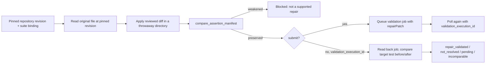
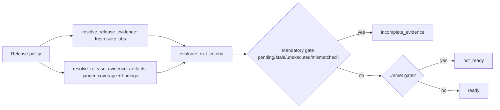

# Automation maintenance and release readiness

Status: C4 implementation slice. `maintain_automation` (AUE) and `assess_release_readiness` (QAE) are wired through the existing agent, MCP, HTTP and CLI dispatchers. Both are read-dominant: `assess_release_readiness` never executes anything, and `maintain_automation` executes only a single reviewed repair patch inside the existing durable repository worker's disposable checkout. No acceptance scenarios have been run for this slice; see [progress handoff](qa-progress-handoff.md).

## `maintain_automation`

A selector/fixture/setup repair for one failing repository test is rejected before any job is queued unless every originally present assertion's expectation is still present and no skip/only marker was introduced. Locator/selector calls are collapsed before comparison, so a selector repair does not read as a removed assertion; a changed expected value, a removed check, or `.skip`/`.only`/`xit`/`xdescribe` does.



Operations: `resolve_suite_profile`, `collect_failure_evidence` (reused from `investigate_defect`), `resolve_repository_revision_source`, `prepare_patch_candidate`, `compare_assertion_manifest`, `validate_patch_candidate`.

### Repository worker changes

A repository profile may now declare `allowedRepairPaths`, a list of distinct relative file paths. A run may carry one `repairPatch: {path, diff, baseContentHash}` (bounded to 20 KB); the control plane computes and pins its `diffHash`, rejects paths outside `allowedRepairPaths`, and persists it on the run (`qa_autonomous_runs.repairPatch`, additive migration `20261104-repository-repair-patch.sql`). Idempotent resubmission with a changed patch conflicts, matching existing dataset idempotency.

The worker applies the patch to the disposable `git archive` checkout — a single confined `git apply --unsafe-paths` — **before** the checkout is bind-mounted read-only into the framework container, and reports `repairPatchHash` in its observation. `repositoryResult` only treats the run as complete when that hash matches the pinned patch, so a worker that silently skipped or substituted a patch cannot read as a passing repair.

### Validation semantics

- `compare_assertion_manifest` is the only gate before submission. It is deterministic text comparison, not semantic equivalence: a rewrite that happens to change line shape in an unexpected way can be rejected and need manual review.
- Submission (`submit: true`) requires `can_execute` and queues exactly one job carrying the reviewed patch; a second call with `validation_execution_id` reads it back.
- `repair_validated` requires the target test's last attempt to be `passed` in the validation job and the job's observed `repairPatchHash` to match the exact reviewed diff. `not_resolved` means the target test still did not pass. `pending` means the job has not finished. `incomparable` means the job doesn't match this suite binding or lacks complete evidence.
- `review_decision` is always `requires_review`. A passing validation is not an automatic merge, baseline approval, or a guarantee beyond the one target test.
- Only single-file selector/fixture/setup repairs are supported. Multi-file patches, new dependencies, and code generation remain out of scope for this version.

### Repository profile additions

```json
{
  "allowedRepairPaths": ["tests/checkout.spec.ts", "tests/fixtures/checkout.ts"]
}
```

Regenerate the profile with the existing CLI and reinstall it in both `AUTONOMY_REPOSITORY_PROFILES` (control plane) and `AUTONOMY_REPOSITORY_PROFILE_PATHS` (worker); these remain two independently configured registries of the same repository, consistent with the existing C2/C4 convention.

### Invocation

```json
{
  "skill_name": "maintain_automation",
  "inputs": {
    "suite_profile_id": "checkout-smoke",
    "source_execution_id": "<failed job UUID>",
    "check_id": "repository-check",
    "test_id": "<approved framework test SHA-256>",
    "repair_patch": {
      "path": "tests/checkout.spec.ts",
      "diff": "<unified diff touching only this file>",
      "base_content_hash": "<SHA-256 of the pinned file content>"
    },
    "submit": true
  }
}
```

Omit `submit` and `validation_execution_id` to run only the manifest check (`state: "manifest_checked"`) before deciding whether to queue a job.

## `assess_release_readiness`

Evaluates a configured release-gate policy against fresh, owned suite jobs at a candidate revision plus pinned coverage/finding artifacts. It never calls `/runs` with a write; every suite job it reads is one the caller already ran.



### Policy

```json
{
  "repository_id": "web-app",
  "required_suites": [{ "suite_profile_id": "checkout-smoke", "mandatory": true }],
  "min_design_coverage_percent": 80,
  "max_open_findings": 0,
  "evidence_ttl_seconds": 3600
}
```

Grant `release_policies` in the app's `QA_WORKFLOW_RESOURCES`, pointed at via `QA_RELEASE_POLICIES` (ID → absolute JSON path), the same pattern as `QA_REGRESSION_PROFILES`.

### Evidence rules

- Each required suite gate reads its supplied `execution_id` fresh from the suite control plane; staleness is `createdAt` age versus `evidence_ttl_seconds`, and revision match is against the candidate revision (the suite's `targetRevision`, or its pinned `revision` for legacy profiles without instrumented app-revision evidence).
- A mandatory gate not supplied at all reads as `unexecuted`, not silently passing.
- `queued`/`running` reads as `pending`; `failed`/`error`/`cancelled`/`interrupted` pass through as-is; a revision mismatch or stale evidence is reported distinctly from both.
- Coverage comes from a pinned `analyze_coverage` artifact (`design_coverage_percent`, `uncovered_criterion_ids`, `stale_execution_ids`); it is **designed** coverage, not executed/evidenced coverage.
- Findings come from pinned `investigate_defect` artifacts; any state other than `not_reproduced` counts as open against `max_open_findings`.
- Any mandatory gate in a non-terminal/incomplete state — or missing pinned coverage when a coverage threshold is configured — forces `recommendation: "incomplete_evidence"` rather than a `ready`/`not_ready` guess.
- `release_authorized` is always `false`. A recommendation is not a release authorization; that remains a separate platform/user decision.

### Invocation

```json
{
  "skill_name": "assess_release_readiness",
  "inputs": {
    "profile_id": "web-app-release",
    "candidate_revision": "reviewed-deployment-revision",
    "suite_gates": [{ "suite_profile_id": "checkout-smoke", "execution_id": "<completed job UUID>" }],
    "coverage_artifact": {
      "producer": "qae.analyze_coverage",
      "request_id": "<coverage artifact UUID>",
      "content_hash": "<coverage artifact SHA-256>"
    },
    "finding_artifacts": []
  }
}
```

## Remaining work

No real repository, suite, release policy or repair-approved profile is enrolled locally; no live patch application, job submission or policy evaluation has been exercised end to end. Implementation checks performed: API TypeScript build (`npm run build -w apps/api`), Python module compilation and catalog/graph construction for both new skills, and unit-level checks of `apply_repair_patch`/`compare_assertion_manifest` against hand-built diffs (safe selector repair accepted; removed assertion, added skip marker, and widened timeout all rejected). No tests were added or run against `agents/tests/`, consistent with the standing instruction not to add/run tests unless requested.

This closes the remaining C4 skill set from the roadmap. Shared evidence export, automated pipeline handoff (selection → execution → findings → repair/retest → coverage → release), legacy record ownership reconciliation, real repository/suite/policy enrollment, and the full Phase 1 acceptance journey remain open.
