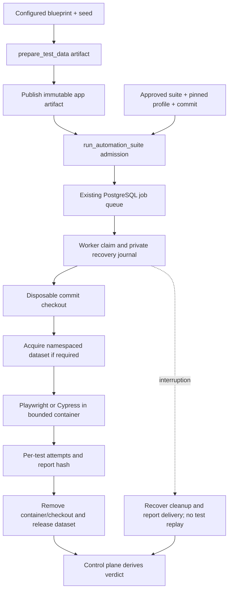

# Phase 1: synthetic data and repository suite execution

Status: C2 implementation slice, not acceptance-verified. No repository, suite, dataset service or runner image is enrolled locally yet. No suites, model calls or live provisioning were executed during implementation.

## Skills and lifecycle

- `prepare_test_data` — QAE/AUE. Resolve a configured blueprint and generate a reproducible synthetic fixture artifact from an explicit seed. The artifact says `prepared`, `lease: null`, `provisioning: on_job_claim`.
- `run_automation_suite` — AUE. Submit an already approved repository suite at an exact commit to the existing PostgreSQL autonomy queue. Returns a job reference immediately.
- `get_execution_job` / `cancel_execution_job` — existing generic tools extended with `provider: "autonomy"` and `suite_profile_id`. Browser harness defaults remain compatible.

The worker owns the data lease. Preparing data in a conversational turn does not leave a live namespace waiting for a later chat message. On claim, the worker reproduces the fixture, provisions its namespace, runs the configured tests and releases the namespace on every exit path. Each run has a different namespace; the same request UUID retrieves its original job.



## Bounded first adapter contract

- One repository check per suite; 1–100 approved test IDs, 1–30 exact spec paths and up to two retries.
- Repository execution uses a full 40-character Git commit. The working tree is untouched. Git archive extraction accepts regular files/directories only, with a 64 MiB / 10,000-entry budget. Submodules, symlinks and tracked dependencies are unsupported.
- npm `package-lock.json` is required. An immutable dependency/browser image must contain `/opt/qa/node_modules` and `/opt/qa/lock.sha256` matching the selected project's lockfile. Runtime installation and arbitrary setup commands are unavailable.
- A starter image Dockerfile lives in `agents/shared/harness/repository_runner/Dockerfile`. Supply an immutable browser base appropriate to the installed framework. Custom lifecycle/build requirements need an operator-maintained image; the starter disables package install scripts.
- Framework versions must match exactly. The Playwright reporter requires 1.44+; Cypress must expose module API per-test attempts. Unsupported output fails closed.
- Container execution is non-root, with read-only root filesystem, bounded writable tmpfs, CPU/memory/PID limits and disabled Docker logs. Only checkout/profile/adapter directories are mounted read-only; host environment credentials are not forwarded.
- The default network is `none`, suitable for an app started inside the test container. A named network must be explicitly listed in `AUTONOMY_REPOSITORY_NETWORKS` and isolated by the deployment to permitted staging destinations. `host`, `bridge` and `default` networks are rejected. The worker does not implement a general HTTP egress proxy for arbitrary repository code.
- Framework timeout is 10–180 seconds within the existing five-minute job admission deadline. Queue delay consumes that job deadline. This is a bounded smoke-suite adapter, not unlimited full-regression execution.
- No automatic patch application, baseline approval, expected-failure reinterpretation, sharding, pnpm/Yarn setup or custom dependency installation. Those remain later depth work.

Playwright uses a custom reporter's discovered tests and test-end attempts. Cypress uses the Node module API's returned spec/test/attempt records. See the official [Playwright reporter interface](https://playwright.dev/docs/api/class-reporter), [suite hierarchy](https://playwright.dev/docs/api/class-suite) and [Cypress module API](https://docs.cypress.io/app/references/module-api).

### Verdict rules

The API compares every discovered test ID with the deployment-approved inventory. Empty runs, missing/extra/duplicate tests, absent attempts, missing report hash, mismatched revision/version, incomplete cleanup, skips and interruptions cannot pass. Failed/timed-out final attempts produce failure only when the report is otherwise complete. Earlier failure followed by success is retained as mixed attempts and yields an error verdict. A clean pass requires all attempts to pass and exit code zero.

Per-attempt status/retry/duration observations are stored on the durable job. Bounded report JSON is retained by content hash in the worker's durable state directory; raw stdout and attachment files are not exported in this slice. Screenshot/trace/object-storage export remains an evidence-ingestion gap. A report hash alone does not prove product correctness; execution relies on the approved repository assertions and the trusted worker.

Agent Settings → Skills → recent suite result shows current job status, counts, attempts and cleanup, refreshed while work or cleanup remains pending. The submission artifact itself stays immutable.

## Dataset blueprint and protocol

Example blueprint file (illustrative, not enrolled):

```json
{
  "environment": "staging",
  "origin": "https://staging.example.com",
  "lease_path": "/__qa/leases/{namespace}",
  "records": 2,
  "fields": {
    "id": {"kind": "identifier"},
    "name": {"kind": "constant", "value": "Synthetic QA item"},
    "quantity": {"kind": "integer", "minimum": 1, "maximum": 5},
    "category": {"kind": "choice", "choices": ["standard", "priority"]}
  }
}
```

Identifiers, integers and choices derive from a versioned SHA-256 seed/index/field recipe. Up to 20 fields and 100 records fit a 48 KB fixture budget. This is synthetic input generation, not an expected-behavior oracle.

Configure the agent's `QA_DATASET_PROFILES` as `{ "orders": "/absolute/blueprint.json" }` and grant `orders` in the app's `QA_WORKFLOW_RESOURCES.dataset_profiles`. Then invoke:

```json
{"skill_name":"prepare_test_data","inputs":{"profile_id":"orders","seed":42}}
```

The worker independently loads the same exact blueprint bytes through `AUTONOMY_DATASET_PROFILE_PATHS` keyed by file SHA-256 and reproduces the artifact's values and fixture hash before writing data. A changed file fails the hash check.

The staging service must implement this contract at the configured path:

1. `PUT` body: `{namespace, ttlSeconds:600, blueprintHash, fixtureHash, records}`. Create one isolated namespace with server-enforced TTL; return 201 and exactly `{namespace, ttlSeconds:600, blueprintHash, fixtureHash}`.
2. `GET` after provisioning: return 200 with the same metadata, proving the acquired lease refers to the intended fixture.
3. `DELETE`: return 200/204/404. A following `GET` must return 404 before cleanup is called clean.
4. The worker journals intent before `PUT`. It never retries uncertain acquisition. Recovery performs cleanup only. Keep the immutable profile and credentials available until every pending lease is cleared.

The existing pinned HTTPS transport enforces `AUTONOMY_ALLOWED_ORIGINS`, private-address CIDR policy, TLS, bounded bodies and no redirects. Credential references come from `AUTONOMY_SECRET_REFS` on the worker; credentials are not written into fixture artifacts or passed to the test container. Provisioned data must be accessible to the approved test arrangement. General authenticated browser session injection is not implemented here.

Tests receive `QA_DATASET_NAMESPACE`; Cypress additionally receives it in Cypress environment configuration. Namespace ownership is the durable job, not a reusable global fixture.

## Repository profile and enrollment

A worker profile contains the public identity and private execution settings:

```json
{
  "projectId": "actual app/project UUID",
  "environment": "staging",
  "repositoryId": "web-app",
  "revision": "full 40-character Git commit",
  "framework": "playwright",
  "frameworkVersion": "exact installed version",
  "expectedTests": ["reviewed 64-character test ID"],
  "image": "sha256:immutable image ID",
  "network": "none",
  "specs": ["tests/orders.spec.ts"],
  "projectPath": ".",
  "projects": ["chromium"],
  "timeoutSeconds": 120,
  "retries": 1,
  "datasetProfileHash": "SHA-256 of blueprint file bytes",
  "datasetOrigin": "https://staging.example.com"
}
```

Replace descriptive placeholders with real values. Omit both dataset fields for suites that need no provisioned data. Cypress uses `framework: "cypress"`, exact Cypress spec paths and an empty `projects` list.

Test identity is SHA-256 of JavaScript `JSON.stringify([relativeSpecPath, projectName, titleSegments])`. For Playwright, `titleSegments` contains nested `describe` titles followed by the test title; for Cypress it is the returned `test.title` array and project name is empty. Paths use `/`. Build the approved inventory from reviewed test declarations; dynamic titles/parameterization must resolve to the exact expected IDs. Changing selection, revision or expectations requires a new profile/suite approval. There is no automatic approval from observed app behavior.

Worker configuration:

```dotenv
AUTONOMY_REPOSITORIES={"web-app":"/absolute/local-git-repository"}
AUTONOMY_REPOSITORY_PROFILE_PATHS={"profile-file-sha256":"/absolute/suite-profile.json"}
AUTONOMY_DATASET_PROFILE_PATHS={"blueprint-file-sha256":"/absolute/blueprint.json"}
AUTONOMY_REPOSITORY_STATE=/absolute/private-durable-worker-state
AUTONOMY_REPOSITORY_NETWORKS=["none"]
```

Each worker instance owns its state directory. Retain this directory across restarts; it stores private worker lease tokens, cleanup state, completion outbox and report artifacts.

Generate the API's public registry entry without running the suite:

```sh
PYTHONPATH=agents python -m shared.harness.repository profile /absolute/suite-profile.json
```

Set that output as `AUTONOMY_REPOSITORY_PROFILES` on the API. Its app ID/environment must match the project, and its dataset origin must belong to the project's deployment-approved origins.

Use the existing suite creation/approval endpoints to create a single check:

```json
{"id":"orders-smoke","requirement":"an existing project requirement","kind":"repository","profileHash":"profile-file-sha256"}
```

Existing suite-owner approval and project quotas remain required. The agent does not mint approvals. Bind the approved suite for the agent:

```dotenv
QA_AUTOMATION_SUITES={"orders-smoke":{"project_id":"actual project UUID","suite_id":"approved suite UUID","profile_hash":"profile-file-sha256","project_key_env":"QA_SUITE_PROJECT_KEY"}}
```

Grant `orders-smoke` through `QA_WORKFLOW_RESOURCES.automation_suites`. Store the actual project-scoped key in its named environment variable. Submission accepts the existing owner/admin/CI roles; cancellation retains the existing owner/admin policy. The runner uses its separate runner key in `AUTONOMY_PROJECT_KEY`.

Invoke AUE with a stable request UUID, `suite_profile_id`, `expected_repository_revision` and optional `dataset_artifact: {request_id, content_hash}`. The data artifact must already be published to the same app. HTTP/CLI/MCP all use this common skill contract. Poll with `provider: "autonomy"`, the returned job ID and `suite_profile_id`.

## Recovery and deployment

- Apply `apps/api/migrations/20261004-repository-execution.sql` after the foundation migration in production. Development TypeORM synchronization adds the two nullable columns. Existing runs remain readable.
- Restart API, Python runtime and worker; reconnect MCP clients for discovery.
- Run the existing worker: `PYTHONPATH=agents python -m shared.harness.autonomy worker`. Repository recovery happens before claims when its state directory is configured.
- Explicit recovery: `PYTHONPATH=agents python -m shared.harness.repository recover` with the same runner identity and state directory.
- Cancellation, project pause, credential rejection and revoked deployment approval stop further worker execution on polling. The worker removes its container/checkout and releases its dataset. Unknown cleanup remains pending and blocks new repository work using that state directory.
- Recovery never reruns tests or repeats provisioning. It retries cleanup and immutable completion delivery. Late completion cannot overwrite a cancelled/interrupted job. An interrupted worker without a complete result remains unknown until the existing deadline reconciliation; it cannot claim a pass.
- Cleanup receipts are stored separately and may complete after cancellation. Original verdicts are not rewritten when later cleanup succeeds. After key rotation, a current runner in the same app may deliver cleanup for a terminal job using the original private claim token; it cannot complete or resume that execution.
- To disable admission, remove the suite binding/profile or pause the project. Keep recovery profiles, state, approved cleanup origin and worker credentials until pending cleanup is resolved. No automatic database rollback/data deletion is provided.

## Checks and remaining gates

API compilation, frontend TypeScript compilation, Python/Node syntax and registry/subgraph construction are implementation checks. No tests, container builds, framework runs, data provisioning or acceptance scenarios were performed.

Real repository enrollment, both adapter acceptance cohorts, cancellation/restart/isolation verification, full evidence export and the full Phase 1 journey remain open. [C3 API/investigation](qa-api-investigation.md) is implemented in bounded form. [C4 regression selection](qa-regression-selection.md) adds optional configured-origin app revision probes and published case-to-test links to repository profiles; acceptance remains open. Automation maintenance and release readiness remain planned. The currently supplied Herdly URL remains an observation target; no suite or dataset service has been inferred from it.
