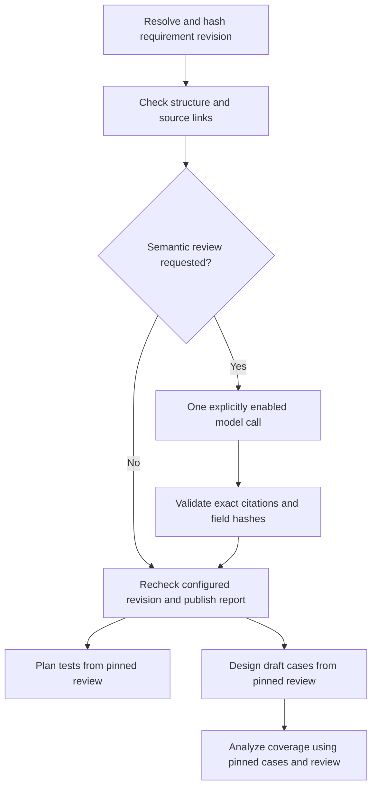

# Phase 1: requirement review and artifact handoff

Status: implemented C1 requirement-review slice; acceptance scenarios have not been run. The subsequent [C2 implementation slice](qa-repository-execution.md) adds bounded dataset and repository execution; its acceptance gates remain open in [the roadmap](qa-package-roadmap.md).

## Actual wiring

`review_requirements` is a QAE skill with a dedicated LangGraph subgraph. HTTP, CLI, QA MCP, QAE and Super QA delegation use the same registry, schema and implementation. Agent Settings displays the registered skill and its five executable operations; the report view shows structural observations separately from model proposals.



Deterministic checks report missing acceptance criteria, absent/unresolved source links, absent executable procedures, whitespace-only steps, placeholder expected results, normalized duplicate criteria and lexical ambiguity hints. An absent procedure is not treated as proof of an absent expectation. Source links do not prove semantic entailment.

Semantic review requires both `mode: "semantic"` and `allow_model: true`. It makes at most one model call with a 45-second limit, no client retries, a 96 KB field budget and at most 20 proposed findings. Every proposal must cite an exact substring of a known field with its matching hash. A possible contradiction needs at least two distinct cited fields. Invalid model output is rejected as a whole; deterministic observations remain in an incomplete report. The model asks clarification questions; it does not write replacement requirements or approve expectations.

Report states are `needs_clarification`, `no_structural_gaps`, `incomplete` and `stale`. No state is a test verdict or requirement approval. Structural output is bounded to 200 findings and reports the total and truncation explicitly. Snapshot input is limited to 128 KB. Large reviews should be split.

## Inline snapshot

An illustrative dispatcher request (not an assertion about Herdly):

```json
{
  "skill_name": "review_requirements",
  "inputs": {
    "mode": "structural",
    "snapshot": {
      "schema_version": 1,
      "sources": [
        {"id": "SPEC-1", "revision": "rev-7", "text": "Submitting an empty name displays Name is required."}
      ],
      "requirements": [
        {
          "id": "REQ-1",
          "title": "A name is required",
          "evidence_ids": ["SPEC-1"],
          "criteria": [
            {
              "id": "AC-1",
              "text": "Submitting an empty name displays Name is required.",
              "steps": [{"action": "Submit the form with the name empty", "expected": "Name is required is displayed"}]
            }
          ]
        }
      ]
    }
  },
  "allow_model": false
}
```

Sources are bounded supplied excerpts, with caller-supplied revision labels. `evidence_ids` link to source IDs in this snapshot. These labels are not independently verified against Jira, a document service or another upstream system. Field paths, content hashes and per-requirement hashes identify the exact reviewed data.

## Configured revisions

For automatic freshness checks, configure an operator-owned JSON snapshot file with the same snapshot shape:

```dotenv
QA_REQUIREMENT_PROFILES={"checkout":"/absolute/path/checkout-requirements.json"}
```

Add `"requirement_profiles": ["checkout"]` to the existing app entry in `QA_WORKFLOW_RESOURCES`. Resource discovery exposes IDs, never file paths. File selection cannot come from agent input. Keep the snapshot synchronized with the authoritative source using the deployment's source update process; this implementation does not add an upstream synchronization connector.

Call with `inputs: {"profile_id": "checkout", "mode": "structural"}`. An optional `expected_snapshot_hash` rejects a changed snapshot before review. The complete snapshot hash covers source revisions/content, criteria, steps and risk metadata. A changed or unavailable file at finalization yields a stale, blocked report. Update files atomically to avoid partial reads.

Historical reports remain immutable. Freshness is a check at the recorded instant, not a live badge or a continuously monitored subscription. Use a new request UUID after revision changes; the same UUID returns its original result.

## Typed handoff

`plan_tests`, `design_test_cases` and `analyze_coverage` accept either inline `requirements` or `requirement_review`, exclusively:

```json
{
  "skill_name": "design_test_cases",
  "inputs": {
    "requirement_review": {
      "request_id": "UUID from the completed review",
      "content_hash": "review artifact.content_hash",
      "current_snapshot_hash": "review data.snapshot_hash"
    },
    "preconditions": []
  }
}
```

Replace descriptive placeholders with actual values. `current_snapshot_hash` is required for inline snapshot reviews and is an explicit caller assertion of the current version. It does not independently verify an upstream source. Configured profiles are reread and compared with the stored snapshot hash before and after consumer computation; callers cannot disable this check by supplying a hash.

Artifact resolution enforces the trusted app scope, producer, schema/version, completed workflow state, content hash and requirement snapshot hash. Incomplete/stale reviews cannot be consumed. Unresolved findings remain recorded in `input_provenance`; drafts may still be produced from usable criteria and are not approvals. Missing criteria/steps retain the existing case-design blockers and explicit model opt-in.

AUE may consume a QAE artifact in the same app for coverage. Coverage can use `case_artifact: {"request_id": "...", "content_hash": "..."}` together with `requirement_review`, instead of inline `cases`. Case artifacts must come from `qae.design_test_cases` with matching requirement snapshot provenance. Legacy case artifacts without this provenance remain readable but cannot enter this handoff. Existing explicit inline case inputs remain supported and are still caller-supplied observations.

Generated case IDs incorporate the pinned requirement snapshot hash. A changed snapshot produces different case IDs, preventing prior execution records from satisfying the new case identities just because a criterion ID was reused. Case artifacts still have draft review status; model-generated steps remain proposals.

## Persistence and deployment

The existing local store and immutable publication outbox persist the report. Consumers can use a local scoped artifact or recover its exact published payload from PostgreSQL through a purpose-signed internal read:

`GET /api/workflow-artifacts/{projectId}/{requestId}`

The retrieval signature uses the shared server-side `AGENT_MEMORY_SIGNING_KEY`, a distinct `qa-workflow-read-v1` purpose, scope and request ID, and a five-minute timestamp window. The app scope is inherited from trusted invocation context. A caller cannot choose a different app through the skill schema. Pending artifacts are usable on the runtime holding them; other runtime instances need successful publication first. Shared retrieval is read-only and does not synthesize local invocation records.

No additional database migration is needed beyond the existing `qa_workflow_artifacts` foundation migration. Restart the Python runtime/API and reconnect MCP clients for updated discovery. Removing a requirement-profile grant blocks future configured handoffs; existing reports remain historical artifacts. Inline workflows preserve their prior interface.

## Check status and remaining work

Python syntax parsing, registry/subgraph construction, API build and frontend TypeScript compilation were performed. No automated tests, model calls, source reviews, browser runs or end-to-end acceptance scenarios were executed.

Future acceptance work includes malformed/missing source links, missing expectations, unverifiable citations, model timeout, changed revisions during review/design, cross-app denial, hash mismatch, shared-store recovery, stale case linkage and the UI report path. These behaviors are implemented but not acceptance-verified.

The C2 implementation still needs enrollment of a real repository/revision/framework run profile and a staging dataset lifecycle service. Herdly's browser URL alone does not supply either dependency. No test expectations or deployment profiles were invented for it.
