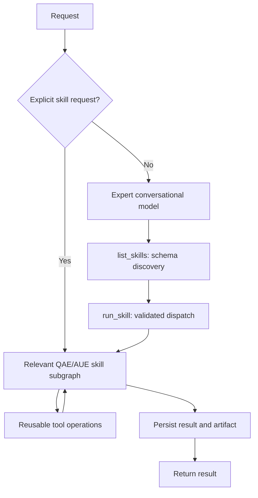
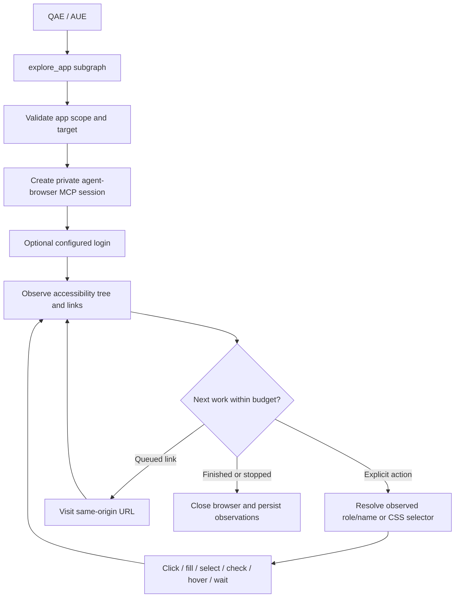

# QA skills and workflow subgraphs

QAE and AUE now have reusable LangGraph subgraphs with validated inputs and persisted output artifacts. Explicit workflow requests bypass the conversational model. Natural-language chat uses `list_skills` to discover input schemas and `run_skill` to invoke the same subgraphs. Super QA discovers the expert catalog and delegates through QAE/AUE while retaining its existing platform management tools.

See [Phase 1 foundation](qa-phase-1-foundation.md) for readiness configuration, shared artifact publication and execution job lookup/cancellation.

See [requirement review and handoff](qa-requirement-review.md) for versioned snapshots, optional semantic review and case provenance.

See [repository execution and data preparation](qa-repository-execution.md) for the bounded C2 adapters, setup, recovery and open acceptance gates.

See [API testing and defect investigation](qa-api-investigation.md) for approved request sequences, explicit assertions, revision checks and bounded reproduction.

See [regression selection and traceability](qa-regression-selection.md) for C4 selection, pinned case-to-test mappings and repository app revision evidence.

See [automation maintenance and release readiness](qa-release-and-maintenance.md) for the remaining C4 skills: validated repair patches and release-gate evaluation.

## Implemented catalog

| Skill | Expert | Behavior | Model calls |
| --- | --- | --- | --- |
| `select_regression_tests` | Both | Exact Git diff, pinned case links, mandatory smoke and conservative whole-suite selection with explicit budgets | 0 |
| `test_api` | Both | Durable submission of an approved API sequence at a pinned app revision; scoped fixtures and server-evaluated assertions | 0 |
| `investigate_defect` | Both | Source evidence, optional single reproduction submission, and revision-aware failure comparison; root cause unproven | 0 |
| `prepare_test_data` | Both | Reproducible synthetic fixture artifact; worker-owned lease provisioning/cleanup during execution | 0 |
| `run_automation_suite` | AUE | Durable submission of an approved, pinned Playwright/Cypress repository suite | 0 |
| `review_requirements` | QAE | Versioned structural review, source-link gaps and optional exactly cited semantic questions; pinned artifact handoff | 0 by default; at most 1 for explicit semantic review |
| `check_test_readiness` | Both | Expiring snapshot of configured target/revision/repository/credential/worker prerequisites; explicit blockers | 0 |
| `plan_tests` | QAE | Draft scope, priorities from supplied impact × likelihood, environments, missing prerequisites | 0 |
| `design_test_cases` | QAE | One reviewable case per explicit criterion; copy supplied executable steps | 0 when steps exist; at most 1 to draft missing steps with `allow_model: true` |
| `analyze_coverage` | Both | Criterion traceability matrix, uncovered criteria, case revision checks, execution evidence gaps | 0 |
| `build_test_matrix` | Both | Complete Cartesian matrix with exclusions and an explicit row budget | 0 |
| `inspect_framework` | AUE | Bounded read-only repository inspection for Playwright/Cypress, configurations, scripts and fixture imports | 0 |
| `generate_automation` | AUE | Compile concrete actions/assertions into a test source artifact and new-file patch | 0 |
| `execute_browser_test` | Both | Submit an approved harness proposal to the existing browser execution admission endpoint | 0 |
| `browser_execution_status` | Both | Read authoritative worker outcome and evidence metadata | 0 |
| `explore_app` | Both | Live app exploration through agent-browser MCP, optional configured login, explicit interactions, page/state map; static bundles also supported | 0 |
| `analyze_failures` | Both | Deterministic failure categories and mixed outcomes for the same case revision/environment/target revision | 0 |
| `maintain_automation` | AUE | Reject repairs that weaken an assertion; otherwise queue/read back one validated patch job in a disposable checkout | 0 |
| `assess_release_readiness` | QAE | Evaluate configured release gates against fresh owned suite jobs, pinned coverage and findings at a candidate revision | 0 |

`shared/skills/registry.py` owns the skill catalog, input schemas, and declared tool dependencies. `shared/skills/operations.py` registers executable operation bindings beside their implementations, resolves shared dependencies, and records operation names/statuses without arguments or outputs. A workflow invocation can only call its declared registered operations. LangChain and QA MCP use the same dispatcher tools. The HTTP catalog preserves the skill names above.

### Skills compose tools

| Skill | Tools it uses |
| --- | --- |
| `select_regression_tests` | `resolve_regression_policy`, shared artifact readers, `read_pinned_revision_changes`, `resolve_mapped_suite_inventory`, `select_impacted_suites` |
| `test_api` | `resolve_suite_profile`, `enqueue_api_sequence` |
| `investigate_defect` | `resolve_suite_profile`, `collect_failure_evidence`, `queue_reproduction_attempt`, `compare_failure_evidence` |
| `prepare_test_data` | `resolve_dataset_blueprint`, `generate_fixture_values` |
| `run_automation_suite` | `resolve_suite_profile`, `submit_suite_job` |
| `review_requirements` | `resolve_requirement_revision`, `validate_criteria_structure`, optional `propose_requirement_findings`, `validate_requirement_citations`, `assemble_requirement_assessment` |
| Planning, case design and coverage artifact handoff | Shared `resolve_artifact_inputs`, `read_pinned_workflow_artifact`, `resolve_requirement_revision` |
| `plan_tests` | `rank_requirement_risks`, `find_planning_gaps`, `assemble_plan_document` |
| `design_test_cases` | `collect_missing_case_steps`, optional `draft_acceptance_steps`, `assemble_case_records` |
| `inspect_framework` | `read_repository_file`, `scan_repository_files`, `read_framework_profile` |
| `generate_automation` | The same repository tools plus `compile_test_source` |
| `execute_browser_test`, `browser_execution_status` | Shared `verify_execution_scope` and `call_execution_api` |
| `explore_app` | `browser_navigate`, `browser_snapshot`, URL/attribute reads, explicit interaction operations, configured login, error reads, cleanup; `inspect_static_bundle` for offline mode |
| `maintain_automation` | `resolve_suite_profile`, `collect_failure_evidence`, `resolve_repository_revision_source`, `prepare_patch_candidate`, `compare_assertion_manifest`, `validate_patch_candidate` |
| `assess_release_readiness` | `resolve_release_policy`, `resolve_suite_profile`, `resolve_release_evidence`, `resolve_release_evidence_artifacts`, `evaluate_exit_criteria` |

A tool has a distinct operation name, can serve several skills, and appears once in settings. Some calculations use one operation; more complex workflows compose several. Internal operations remain constrained by workflow input validation and resource scope. Repository operations do not gain arbitrary model-driven filesystem access. Approved test execution still uses the execution harness, while live exploration uses agent-browser MCP.

## Graph structure



Each skill has named stages: input validation, prerequisite inspection, computation/execution, and finalization. Case design additionally branches to `draft_missing_steps` only when executable steps are absent and model use was explicitly enabled. Its strict JSON output cannot add or omit criterion IDs. Model-authored content stays a draft; structural validation does not establish semantic correctness.

The parent graphs expose these nested graphs through LangGraph's subgraph inspection. Internal workflow state stays out of conversation state. The conversational expert loop has a six-model-call limit per invocation. Workflow calls have a 120-second deadline; optional drafting has a 45-second deadline and no model-client retries.

This uses LangGraph's [subgraph invocation and state mapping](https://docs.langchain.com/oss/python/langgraph/use-subgraphs), with the [official MCP Python SDK](https://github.com/modelcontextprotocol/python-sdk) for stdio transport.

## Run a deterministic workflow

From the repository root:

```sh
PYTHONPATH=agents python3 -m shared.skills.cli list --agent qae
PYTHONPATH=agents python3 -m shared.skills.cli run agents/shared/skills/examples/test-plan.json
PYTHONPATH=agents python3 -m shared.skills.cli run agents/shared/skills/examples/test-matrix.json
PYTHONPATH=agents python3 -m shared.skills.cli status eb7dab0e-eb76-4bbf-a596-482db925f711 --agent qae
PYTHONPATH=agents python3 -m shared.skills.cli graph design_test_cases --agent qae
```

The sample UUIDs make repeated identical sample requests return their original artifacts. Use a new UUID for a new task. Reusing a UUID with changed inputs returns a conflict. Execution submissions and exploration requests with actions or authentication require a caller-supplied UUID across HTTP, tools, delegation and MCP. Identical retries return the recorded artifact; they do not repeat browser actions.

## HTTP

The Python agent runtime exposes these internal routes. Configure `QA_WORKFLOW_KEY` with a separate key of at least 32 characters; every route requires `X-QA-Workflow-Key`.

| Route | Purpose |
| --- | --- |
| `GET /workflows/skills/qae` or `/aue` | Catalog with exact JSON input schemas |
| `GET /workflows/resources/{agent_type}` | Configured repository/target IDs visible to the invocation scope |
| `POST /workflows/runs` | Run a `SkillRequest`: `{request_id, agent_type, skill, inputs, allow_model?}` |
| `GET /workflows/runs/{agent_type}/{request_id}` | Retrieve the persisted artifact |
| `GET /workflows/graphs/{agent_type}/{skill}` | Inspect a subgraph as Mermaid |

`allow_model` defaults to false. Unknown fields and invalid references are rejected. A workflow result has `status`, `summary`, `data`, `warnings`, `model_calls`, an ordered stage `trace`, and a `tool_trace` of operation names and completion statuses. Operations that do not run on the selected branch do not appear in the trace. Existing stored artifacts retain their original fields until a new run is created.

**`completed` means the workflow produced an artifact. It is not a test verdict.** Execution outcomes are in `data.execution.status`. Plans, cases, and generated code are drafts. Coverage uses explicit criterion links; requirement-level association alone does not count as criterion coverage. Zero known criteria produces unknown coverage, not 100%. Historical pass/fail observations across targets are not collapsed into a release verdict.

The deployment key is an internal operator capability; do not expose this runtime directly to browsers. Internal HTTP/CLI/MCP use the deployment's `QA_WORKFLOW_SCOPE` (default `local`). Organization chat instead signs the authenticated project ID and browser-execution permission using `AGENT_MEMORY_SIGNING_KEY`. Python verifies that signature and binds the chat session to the app. Unsigned chat cannot use workflow tools. Sessions created before scope binding must be replaced by a new session.

Artifacts are partitioned by trusted app scope. Scoped repository/browser access also requires `QA_WORKFLOW_RESOURCES`, for example:

```json
{
  "project-uuid": {
    "repositories": ["web-app"],
    "browser_targets": ["fixture"],
    "harness_scope": {"workspaceId": "workspace", "applicationId": "app", "environment": "staging"}
  }
}
```

The model cannot change its scope through tool arguments. Member chat can produce analytical artifacts but cannot dispatch browser work; owner/admin assignments can dispatch within configured resources. Harness submissions and status reads also verify the proposal's workspace/application/environment. Local operator invocations use their explicitly configured repository/target maps. A production artifact management UI still needs to expose retrieval through authenticated app routes.

## MCP

Use Python 3.10+ and install `agents/requirements-mcp.txt` in the MCP process environment. The older Python 3.9 development runtime can run the core workflows, but the official MCP SDK requires a newer interpreter.

```sh
PYTHONPATH=agents QA_MCP_ROLE=qae python3 -m shared.mcp.qa.server
```

Configure separate stdio entries for QAE and AUE. Example client configuration (replace absolute paths):

```json
{
  "mcpServers": {
    "superqa-qae": {
      "command": "/path/to/venv/bin/python",
      "args": ["-m", "shared.mcp.qa.server"],
      "env": {
        "PYTHONPATH": "/path/to/ultimate-qa-agent/agents",
        "QA_MCP_ROLE": "qae",
        "QA_WORKFLOW_DB": "/path/to/durable/qa-runs.sqlite3"
      }
    }
  }
}
```

For AUE, use `QA_MCP_ROLE=aue`. MCP exposes `list_skills`, `run_skill`, `get_skill_run`, `list_workflow_resources`, `get_execution_job`, and `cancel_execution_job` from the exact same tool factory as the expert agents. Use `list_skills({"skill_name":"build_test_matrix"})` to retrieve the selected workflow's exact Pydantic input schema, then call:

```json
{
  "name": "run_skill",
  "arguments": {
    "skill_name": "build_test_matrix",
    "inputs": {"dimensions": {"browser": ["chromium", "firefox"], "locale": ["en", "bn"]}}
  }
}
```

**Migration:** previous MCP/conversational tools named after skills (for example, `plan_tests` or `explore_app`) are removed. Replace them with `run_skill` and move their workflow fields under `inputs`; keep `request_id` and `allow_model` at the dispatcher level. Refresh MCP tool discovery after restarting the server. HTTP/CLI `skill` values and Super QA delegation remain unchanged. Cached results for existing request UUIDs remain unchanged.

`get_skill_run` retrieves artifacts across process restarts; `list_workflow_resources` discovers configured IDs without exposing paths or credentials. Invalid/blocked/failed calls have MCP `isError: true`. The stdio process inherits only the capabilities configured for that deployment; credentials never belong in tool arguments.

## Repository and browser capabilities

Set `QA_REPOSITORIES` to a JSON map of repository IDs to trusted paths. AUE takes a repository ID and relative `project_path` for a monorepo package. Reads are bounded, node_modules/build outputs are skipped, paths cannot escape through traversal or symlinks, and configuration/package scripts are never executed during inspection. Both Playwright and Cypress can be discovered; ambiguous detection requires an explicit choice.

Automation generation requires a destination `.spec.ts`, `.test.ts`, `.cy.ts`, or JavaScript equivalent, application-relative navigation, concrete selectors, and at least one assertion. Existing output files are not overwritten. When custom Playwright fixtures are detected, supply a reviewed `test_import` relative to the new file. The generated artifact includes source, SHA-256, framework profile, and a new-file patch. It does not apply files, run package scripts, prove fixture exports, or verify live behavior.

Browser execution reuses `HARNESS_OPERATOR_KEY`, the approved proposal and revision checks, target allowlists, idempotent admission, and the existing browser worker. The skill submits once and returns queued/running/terminal state; poll the status skill with a new workflow request UUID for fresh observations. Reusing a prior status request UUID returns that request's historical artifact.

For offline exploration, `mode: "static_bundle"` reuses `DockerBrowser` and its immutable-image resolution, read-only target snapshot, dropped capabilities, bounded output and disabled network. Configure `HARNESS_BROWSER_TARGETS` and `HARNESS_BROWSER_IMAGE`. Rebuild the image to include exploration:

```sh
docker build --tag superqa-browser:skills agents/shared/harness/sandbox
```

Static exploration breadth-first visits same-origin links within page/depth budgets, records controls without their values, and never submits forms. Live exploration uses the MCP adapter described below. The approved execution harness and autonomy runner continue to own their existing execution verdicts.

## Live exploration with agent-browser MCP

`explore_app` now opens configured live applications through the upstream [agent-browser MCP server](https://github.com/vercel-labs/agent-browser/blob/v0.38.2/cli/src/mcp.rs). The pinned adapter uses the official Python MCP client, typed tool calls and structured response envelopes. Browser mechanics make zero LLM calls. QAE/AUE can interpret observations and request follow-up actions through their existing conversational reasoning loop.



Install in the worker environment (Node 24+ and Python 3.10+):

```sh
npm ci --prefix agents/browser-mcp
npm run install:browser --prefix agents/browser-mcp
python3 -m pip install -r agents/requirements-mcp.txt
```

The adapter resolves `QA_AGENT_BROWSER_BIN`, then the local pinned install, then `agent-browser` on PATH. Set `QA_AGENT_BROWSER_BIN` to an absolute executable path for another deployment layout. Launch the Python agent with the MCP dependencies installed; the older Python 3.9 runtime can still run static/analytical skills, but cannot use live MCP exploration.

Configure trusted targets in `QA_BROWSER_TARGETS`:

```json
{
  "staging": {
    "base_url": "https://staging.example.com/",
    "allowed_domains": ["staging.example.com", "api.example.com", "cdn.example.com"],
    "allow_interactions": true,
    "auth_profile": "staging-qa",
    "ready_selector": "[data-testid=app-ready]",
    "excluded_paths": ["/logout", "/signout", "/admin/delete"]
  }
}
```

Only `base_url` and `allowed_domains` are required. For organization chat, bind `staging` in the project's existing `QA_WORKFLOW_RESOURCES.browser_targets` list. Member assignments cannot dispatch browser work. Resource discovery includes live and static IDs. `mode: "auto"` selects a live target when its ID is present in `QA_BROWSER_TARGETS`; otherwise it selects a static bundle. Use explicit `live` or `static_bundle` to disambiguate IDs. An invalid live target never silently falls back to static execution.

Create the named auth profile using agent-browser's encrypted vault, under the same OS account as the worker. Use its `auth save ... --password-stdin` interface or your secret provisioning process; credentials must not appear in workflow arguments. The adapter calls only `auth_login` for the configured profile when `authenticate: true`. Login reports command completion; `ready_selector` should identify the intended authenticated application state. MFA/challenge flows are not automated. See the upstream [authentication documentation](https://agent-browser.dev/security).

Example discovery request:

```sh
PYTHONPATH=agents python3 -m shared.skills.cli run agents/shared/skills/examples/live-exploration.json
```

That example requires the `staging` target configuration. For explicit interactions, send a new workflow request UUID with inputs such as:

```json
{
  "target_id": "staging",
  "mode": "live",
  "start_path": "/products",
  "authenticate": true,
  "max_pages": 8,
  "max_depth": 1,
  "max_commands": 60,
  "actions": [
    {"action": "fill", "role": "textbox", "name": "Search", "value": "sample product"},
    {"action": "click", "role": "button", "name": "Search"},
    {"action": "wait", "selector": "[data-testid=search-results]"}
  ]
}
```

Use role/name pairs observed in snapshots or known CSS selectors. Role/name must match exactly one observed element; action selectors must also match exactly one element. Wait accepts a selector for content that has not appeared yet. Snapshot refs are session-local and are never accepted from a previous run. Actions require `allow_interactions: true` on the configured target. The worker executes only the supplied sequence; it does not independently invent form data or click arbitrary buttons. Follow-up exploration starts a fresh session and needs its own navigation/action prefix. Repeating writes requires care; interrupted actions are not automatically replayed.

Artifacts contain accessibility snapshots, controls, links, state IDs, transitions, attempted/completed action records, error observations when available, command count, remaining actions and a stop reason. `max_pages` counts observed states, including states after actions. The worker limits each observation to 100 controls, 10 links and 16,000 snapshot characters, queue size to 100 URLs, output to roughly 250 KB, and active exploration to 70 seconds inside the existing 120-second workflow deadline. `complete` refers only to the requested bounded scope. A truncated observation or exhausted budget sets `complete: false`. A workflow can successfully persist a partial artifact; inspect `complete`, `stop_reason`, `error`, and `remaining_actions` before claiming exploration finished. It never returns a test pass verdict.

Each run has a fresh browser session, closed on completion/error/cancellation with a 60-second idle shutdown fallback. MCP process environment excludes application/model credentials, inherits the OS account for its auth vault, and uses explicit browser configuration. Page JavaScript runs normally; the adapter exposes no arbitrary eval, upload, download, plugin, shell, or page-provided WebMCP invocation to QAE/AUE. Allowed domains cover browser network requests, including API/CDN dependencies. Link crawling stays on the exact app origin. Upstream's [domain controls](https://agent-browser.dev/security) are browser controls, not an OS firewall; deploy the browser worker with suitable network isolation for your environment. Live navigation and page scripts can change application data, including through GET requests. Excluded path prefixes constrain discovery/navigation checks, not all backend requests caused by page scripts or a button click.

Explicit fill/select values are omitted from action records and redacted from page text; URL query strings/fragments are omitted from displayed URLs. This is not comprehensive DLP. Snapshots and errors can contain application data and must receive the same scoped storage/retention treatment as other evidence. Page content stays untrusted and cannot expand target scope, select auth profiles, or change browser configuration.

Implementation: `shared/mcp/agent_browser/client.py` owns transport/session lifecycle; `shared/skills/exploration.py` owns deterministic discovery and action sequencing; the existing skill registry exposes the workflow to LangGraph, HTTP, CLI, and QA MCP clients. Raw upstream browser tools are private to the adapter.

Live discovery was exercised against the user-supplied `https://herdly.byoursidee.com` without authentication. Run `6a1ce905-46e8-443e-a094-86248b3bc61b` captured Home, Market, Privacy and Terms with zero LLM calls, stopped at its 50-command budget, persisted a partial artifact and closed the browser. This was a discovery run, not a functional test verdict. The local target has interactions disabled. Authentication and interaction paths have not been exercised, and no automated test suite was run for this extension. The historical verification below predates this extension.

## Persistence and recovery

Artifacts are stored in SQLite at `QA_WORKFLOW_DB` (default `agents/.qa-workflows/runs.sqlite3`) with a private file mode. App-scoped invocations use separate sibling database files named with the scope's SHA-256. Mount durable storage in deployment. Inputs are hashed for idempotency; the store saves results, not raw request bodies. Artifacts can contain supplied requirement text or generated test data, so they need the same access and retention handling as other workspace knowledge.

An atomic claim prevents duplicate concurrent invocations. The same request UUID returns its recorded result; changed inputs conflict. An expired running lease becomes `interrupted` and is not replayed. This is durable result storage with conservative recovery, not LangGraph checkpoint/resume. Browser jobs remain independently durable in the backend. Inspect their actual status before submitting a new request after interruption. Model-call counts are unknown (`null`) after interruption.

## Verification

```sh
PYTHONPATH=agents python3 -m unittest discover -s agents/tests
# In a Python >=3.10 environment with requirements-mcp.txt:
PYTHONPATH=agents python3 -m unittest discover -s agents/tests -p test_skills_mcp.py -v
QA_SKILLS_BROWSER_E2E=1 QA_SKILLS_BROWSER_IMAGE=superqa-browser:skills PYTHONPATH=agents python3 -m unittest discover -s agents/tests -p test_skills_browser.py -v
# Optional dedicated Redis fixture (do not point at an application datastore):
QA_SKILLS_REDIS_URL=redis://127.0.0.1:PORT PYTHONPATH=agents python3 -m unittest discover -s agents/tests -p test_skills_scope_redis.py -v
npm exec -w apps/api -- jest src/modules/agents/agents-workflow.spec.ts --runInBand
npm run build -w apps/api
```

Core tests cover zero-model routing, schema enforcement, model-draft rejection, explicit coverage, matrix budgets, repository/fixture handling, idempotency, concurrent claims, expiry, persistence, role relevance, backend admission failures, and HTTP authentication. MCP tests use the actual stdio protocol and restart the server. The browser check uses a real container and controlled static fixture. Live model quality, customer repositories, and authenticated customer sites are not measured by these checks.

Verified on 2026-10-04: **104 Python tests passed**, with three optional integrations skipped in the default run. Those three checks each passed separately: real MCP stdio/restart, sandboxed browser exploration, and concurrent session binding in an isolated Redis container. **Five API scope-handoff tests and the API production build passed.** The CLI matrix example completed with zero model calls. Existing system-Python LibreSSL and LangGraph deprecation warnings remain.

To enable this implementation in a deployment, restart the API and Python agent runtime with matching `AGENT_MEMORY_SIGNING_KEY` values (at least 32 characters), configure app resource bindings, mount durable workflow storage, and select the rebuilt browser image. Configure `QA_WORKFLOW_KEY` for internal HTTP use or install the optional MCP environment for stdio use. No production deployment or application database migration was performed for this change.
